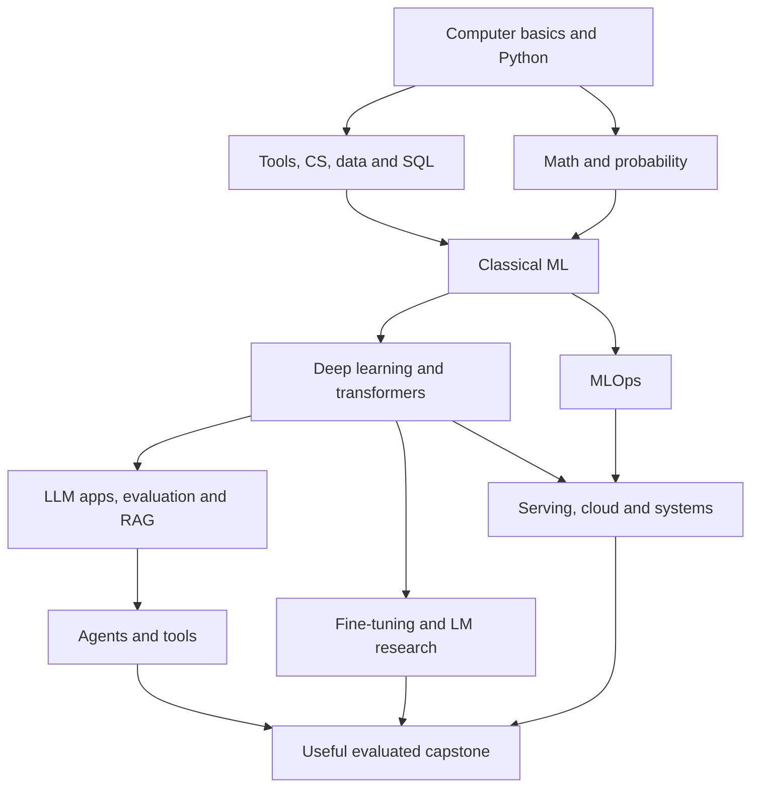

# From zero to broad AI engineering, with one deep specialty

Prepared 2026-10-07. You want to understand the ecosystem, build useful systems and eventually work at a strong AI lab. The target is broad understanding plus demonstrable depth in one role. A single person can learn across roles, but model research, product AI and inference systems require different kinds of depth.

## Recommended route

| Stage | Modules | What becomes possible |
|---|---|---|
| 1: Learn to program | M00–M02 | Write, debug, test and reproduce Python programs |
| 2: Understand software and data | M03–M04 | Build APIs, query data, clean datasets |
| 3: Learn why models work | M05–M08 | Explain training, statistics and neural networks; train your own models |
| 4: Learn language models and applications | M09–M12 | Build evaluated LLM, retrieval and tool systems |
| 5: Adapt and understand models | M13–M14 | Fine-tune, study post-training, train a small LM and reproduce a paper |
| 6: Ship and operate | M16–M18 | Deploy, monitor, optimize and protect systems |
| 7: Explore branches and demonstrate depth | M15/M19/M20 | Choose a modality or specialty and ship a useful capstone |

M16 can begin after classical ML, before agents; deployment is a parallel skill, not something that waits until the final lesson. Security applies whenever you expose a service or give a model tools. M15 and the specialized topics in M19 are branches, not compulsory detours before your first useful product.

## Time: use hours and checkpoints, not promises

The full map has 1,720 estimated working hours including branches, exercises and the capstone. These are my planning allowances, not measured course durations or a guarantee.

| Sustainable effort | Approximate full-map duration, before breaks |
|---|---|
| 10 hours/week | 172 weeks, about 3.3 years |
| 15 hours/week | 115 weeks, about 2.2 years |
| 20 hours/week | 86 weeks, about 20 months |
| 25 hours/week | 69 weeks, about 16 months |

An 18–24 month route is plausible at roughly 18–24 focused hours per week, with scope controlled. If university exams interrupt you, extend the calendar instead of skipping foundations. You can build useful projects well before completing every branch. Your seventh-semester project need not wait for the full map: choose a narrow evaluated problem after the core application stages.

Suggested pacing at 20–25 hours/week: months 1–3 programming/tools/CS/data; 4–7 math/statistics/ML; 8–10 DL/NLP; 11–13 LLM applications/RAG/agents; 14–17 adaptation and production; 18–24 specialization, research reproduction and capstone. Actual checkpoints override these month labels.

## Daily learning loop

A 90-minute session: 20–30 minutes video/reading, 40–50 minutes writing/running/debugging, 10 minutes recall, 5–10 minutes evidence notes. A lecture longer than this becomes multiple sessions. Most time should eventually go into work rather than watching.

After each topic: explain it without notes, solve a small exercise, make one unseen change, and record a misconception. Revisit on days 1, 3, 7 and 14 as an initial spacing heuristic; adjust based on recall rather than treating these intervals as universal.

Weekly: four concept/build days, one integration day, one assessment/review day and one rest/buffer day. A missed day moves tasks forward. It does not generate an enormous guilt-producing backlog.

## Rules for using coding agents while learning

Try the exercise yourself first. Ask for a hint before a full answer. Predict an output before running it. Explain any generated function line by line. Change a requirement without requesting a fresh solution. Keep an independent checkpoint where you work from an empty file.

A topic counts as mastered only when you can explain it, implement or use it appropriately, debug a failure, and state where it is unsuitable. “Watched” and “mastered” must be separate states.

## Start now

Open 10-first-28-days.md and CS50P week 0. Your first deliverable is a small local study tracker, not an agent framework. Keep the broad checklist for orientation; work from the current day’s task.

