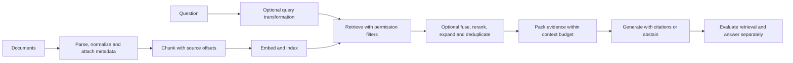

# RAG and agents: understand the system before the names

Study after M09–M10, with M04 data foundations. Main course: C11, followed by C12. This guide expands the M11/M12 checklist.

## A full RAG pipeline

An ordinary retrieval pipeline is a workflow: the steps are programmed. It becomes agentic when a model chooses tools or successive retrieval actions. Agentic behavior adds flexibility and additional opportunities to fail.

## Chunking in depth

First verify extraction. A perfect splitter cannot repair an OCR pipeline that scrambled a two-column PDF. Preserve document title, revision, page/section, stable document ID and permissions.

| Strategy | What it does | Typical reason to try | Common failure |
|---|---|---|---|
| Fixed characters | Cuts at a character count | Simplest debugging baseline | Splits sentences/code; character count differs from tokens |
| Fixed tokens | Cuts using the relevant tokenizer | Enforce model input limits | Breaks logical sections |
| Sentence/paragraph | Keeps natural boundaries | Prose documents | Very long sentence or uneven paragraphs |
| Recursive separators | Tries larger boundaries before smaller ones | Mixed general prose | Separator order and language affect output |
| Structure-aware | Uses headings, HTML blocks, tables or functions | Manuals, documents, code | Parser must retain reliable structure |
| Semantic | Uses similarity changes to choose boundaries | Topic changes not reflected in headings | Extra compute; embedding bias; uneven sizes |
| Parent/child | Indexes smaller units, returns larger parent context | Precise lookup with surrounding explanation | Parent may exceed the answer context budget |
| Sliding windows | Retrieves an anchor and neighboring units | Answers spanning adjacent sentences | Duplicate context and unrelated neighbors |
| Contextual annotation | Adds title/section or generated context to indexed units | Ambiguous standalone fragments | Generated annotation may introduce false information |
| Modality-aware | Keeps image/table/audio alignment with text | Multimodal corpus | Loss of source alignment and higher cost |

Overlap repeats a limited boundary region so an answer crossing a cut remains findable. It also increases index size and duplicate retrieval. “More overlap” is not automatically better.

There is no universal best chunk size. Start with a small experimental grid appropriate to your tokenizer and corpus—for example 256/512/1024 tokens with modest overlap—then compare against a structure-aware baseline. These are experiment settings, not standard requirements. Observe extraction errors, retrieval quality, answer correctness, token cost and latency.

## What “remerge” means

You usually do not reconstruct the entire original document or invert an embedding. You retain source text and offsets when ingesting.

Example: document D has child chunks C1–C10. Search retrieves C4 and C5. Fetch their parent section or adjacent source spans; merge overlapping text ranges, remove duplicate sentences, retain source labels and order, then fit the resulting evidence within the model’s context budget. This is context expansion/assembly. Hierarchical auto-merging is another implementation: when enough child nodes from the same parent are relevant, return their parent.

Store chunk ID, document ID, parent ID, version/hash, source URL/page, character/token span, text, embedding model/version, permissions and timestamps. If documents change, invalidate/reindex affected chunks; changing embedding models can require a full reindex. An embedding is a lossy numeric representation, not compressed text that can reliably be decoded back.

## Embeddings and vector retrieval

Learn query/document encoding, model input limits, multilingual behavior, dimensionality, cosine/dot/L2 and normalization. A dot product includes magnitude; cosine removes that factor. Match the metric and query formatting to the embedding model’s instructions.

Exact kNN gives a correctness baseline. ANN methods trade some retrieval recall for speed and memory. HNSW, IVF and product quantization solve different indexing/storage problems. Index quality is different from relevance quality: an ANN index can faithfully find nearby vectors while those vectors still retrieve irrelevant passages.

A database adds persistence, filters, updates, access boundaries and operational concerns. Use pgvector if PostgreSQL fits your application; use Qdrant if a dedicated vector search service is useful. Neither choice eliminates the need for evaluation. [pgvector](https://github.com/pgvector/pgvector), [Qdrant documentation](https://qdrant.tech/documentation/).

## RAG families: a working taxonomy, not a fixed count

There is no universally agreed set of exactly twelve RAG types. The terms below mix architecture families, retrieval techniques and particular research methods. They overlap; hybrid retrieval plus reranking plus query rewriting can exist in the same system. This is a learning taxonomy, not a standards claim.

| Family or technique | Idea / suitable question | Main trade-off |
|---|---|---|
| Basic retrieve-then-generate | Fetch top passages and answer with context | Easy baseline; may miss relevant evidence |
| Advanced pipeline RAG | Improve parsing, retrieval and context packing | Additional stages need ablation |
| Modular RAG | Replaceable ingestion/search/ranking/generation components | Clear interfaces; more engineering |
| Hybrid RAG | Combine sparse lexical and dense semantic retrieval | Helps different query styles; measure fusion behavior |
| Reranked RAG | Re-score candidate passages with a stronger relevance model | Better candidate ordering at extra latency |
| Multi-query / RAG fusion | Search paraphrases or subqueries and combine ranks | More calls; duplicates and drift |
| HyDE | Generate a hypothetical answer/document to form the retrieval representation | Can help zero-shot retrieval; generated assumptions can mislead |
| Parent-child / hierarchical RAG | Retrieve fine units, expand to sections or summaries | Precision/context balance; context size |
| Contextual retrieval | Add local source context before indexing | Better disambiguation; annotation cost and accuracy |
| Decomposed / multi-hop retrieval | Break a question into dependent evidence needs | Useful for linked facts; errors compound |
| Adaptive RAG | Decide whether/how much to retrieve | Router can misjudge complexity |
| Self-RAG | Original method trains reflection-token behavior | Requires understanding its training, not merely adding a critique prompt |
| Corrective RAG | Assess retrieved evidence and take corrective actions | Evaluator/fallback can fail or increase cost |
| GraphRAG | Use graph structure/community summaries and linked evidence | Can suit global/relationship questions; costly indexing and graph quality |
| Agentic RAG | Agent chooses tools/searches over multiple steps | Flexible; budgets, permissions and trajectories need tests |
| Multimodal RAG | Retrieve image/table/audio/text evidence | Cross-modal alignment and evaluation harder |
| Temporal/freshness-aware RAG | Version/time constraints and updated evidence | Invalidation and time semantics |
| Structured/text-to-SQL augmentation | Retrieve schema or query relational data with validation | SQL permissions/correctness; not every structured query is vector RAG |
| Long-context augmentation | Put larger documents into context, possibly with retrieval | Context cost and distractors; evaluate against retrieval baseline |

See [original RAG](https://arxiv.org/abs/2005.11401), [HyDE](https://arxiv.org/abs/2212.10496), [Self-RAG](https://arxiv.org/abs/2310.11511), [Corrective RAG](https://arxiv.org/abs/2401.15884) and [GraphRAG](https://arxiv.org/abs/2404.16130). Papers define their own methods; a tutorial carrying the same label may implement an approximation.

## An evaluation lab that teaches the trade-offs

Choose 30–50 answerable questions with source-span labels and 10–20 unanswerable or access-restricted questions. Treat this as an initial development set, not enough evidence for a broad statistical claim. Reserve a held-out test set before tuning.

Compare: BM25; dense; hybrid; hybrid with reranker; then one query or chunking change. Keep model/version, corpus snapshot and split fixed. Record recall@k, MRR/nDCG, correctness, citation support, abstention behavior, p95 latency and cost. Query rewriting is an experimental factor: do not quietly omit it or change it between comparison arms. Repeat stochastic stages or cache their outputs when controlling the experiment.

Report a negative result if complexity does not help. Diagnose missing evidence, wrong ranking, poor context packing and unsupported generation separately. Use judge scores only after checking agreement with human labels. [Ragas documentation](https://docs.ragas.io/en/stable/) supports tooling; the task’s metric design remains your responsibility.

## Agents beyond RAG

An agent needs a model interface, tool contracts, state, a control loop, execution permissions, observation handling, stopping conditions, context management and evaluation. Memory is not a single magic database: transient state, durable workflow state, user facts and retrieved knowledge have different retention and correctness requirements.

First build a plain loop with one harmless read-only tool. Then add two tools, an explicit step budget, schema validation, transient errors and trace logging. Persist checkpoints and ensure resumed execution does not duplicate side effects. Introduce human review for actions your application requires to be approved. Compare against a deterministic workflow.

Use LangGraph for a deeper state/recovery implementation; use the HF agents course to inspect smolagents and LlamaIndex alternatives. Learn MCP after you understand the underlying tool contract. MCP standardizes connectivity; it does not decide whether an action is correct or authorized. [LangGraph overview](https://docs.langchain.com/oss/python/langgraph/overview), [HF Agents Course](https://huggingface.co/learn/agents-course/en/unit0/introduction), [MCP introduction](https://modelcontextprotocol.io/docs/getting-started/intro).

Multiple agents are a later experiment. Measure whether splitting a task improves success enough to justify coordination, cost and latency. Coding harness UI comparisons belong to the later product-research phase; this curriculum establishes the fundamentals first.

